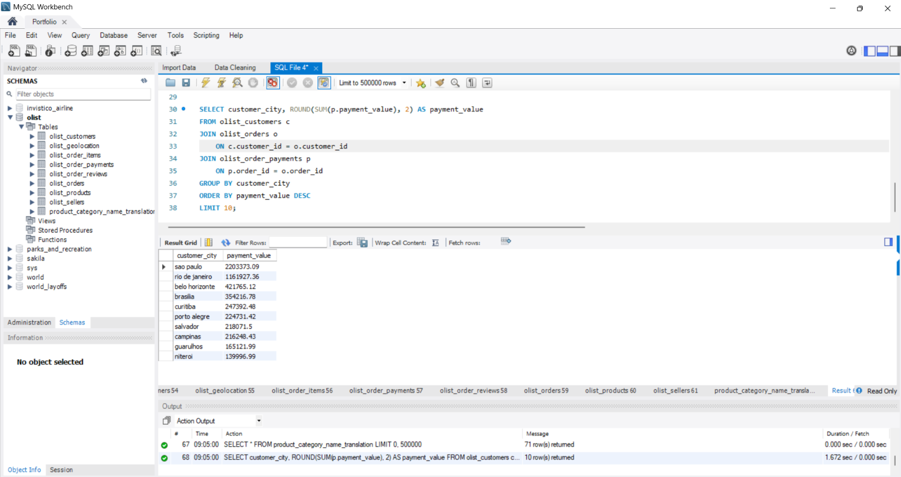
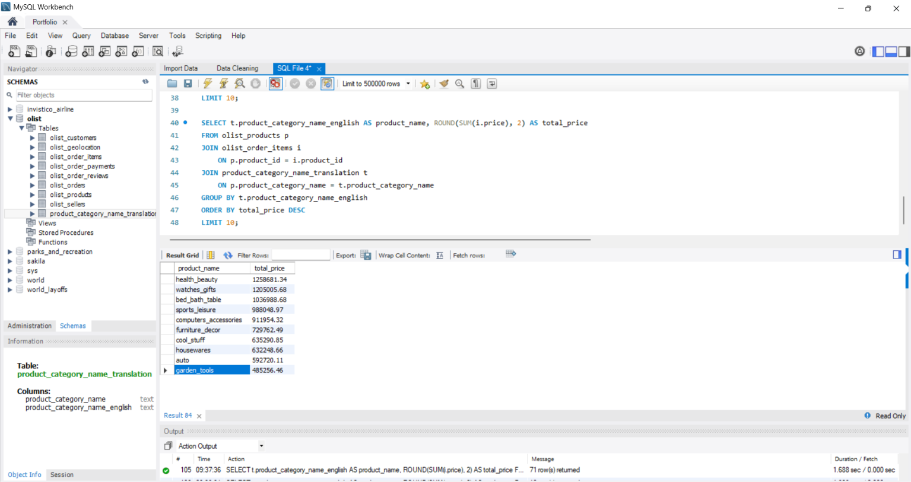

# Brazillian e-Commerce (Olist)
Using MySQL to analyze Olist, a Brazilian e-commerce platform,  to understand sales performance, customer behavior, seller  performance and delivery trends across 8 interconnected tables  using JOINs, CTEs and window functions.

## Executive Summary
To be updated

## Dataset Overview

This dataset is from Olist, a Brazilian e-commerce platform that 
connects small businesses to customers across Brazil. The data covers 
customer orders, payments, reviews, products and sellers across 
multiple tables. All monetary values are in Brazilian Real (R$).

The dataset consists of 8 interconnected tables:

| Table | Description |
|---|---|
| `olist_customers` | Customer information including city and state |
| `olist_geolocation` | City and state information |
| `olist_order_items` | Items within each order including price and freight |
| `olist_order_payments` | Payment details for each order |
| `olist_order_reviews` | Customer reviews and scores for each order |
| `olist_orders` | Order details including status and timestamps |
| `olist_products` | Product details including category and dimensions |
| `olist_sellers` | Seller information including city and state |
| `olist_product_category_name_translation` | Product category names translated from Portuguese to English |

Since this dataset spans multiple tables, JOINs were used throughout 
the analysis to connect relevant information across tables.

## Analysis and Findings

### Top 10 Cities that Generate Most Revenue
Sao Paulo dominates by a very large margin with **R$2,203,373** in 
total payments, almost double the second highest city, Rio de Janeiro 
at **R$1,161,927**. Belo Horizonte comes third with **R$421,765**, 
followed by Brasilia and Curitiba rounding out the top 5.

The remaining cities from Porto Alegre to Niteroi all fall between 
**R$140,000** and **R$250,000**, showing a significant drop off from 
the top two cities.

Honestly, this is not surprising. Sao Paulo is the largest city in 
Brazil and one of the largest in the world, so it naturally leads in 
e-commerce spending. What is interesting is how big the gap is between 
Sao Paulo and everyone else. Even Rio de Janeiro, which is also a major 
city, generates less than half of Sao Paulo's revenue. This tells me 
that Olist's growth strategy should heavily prioritise Sao Paulo while 
finding ways to close the gap in other major cities.

### Top 10 Product Category Generates that Most Revenue

Health and Beauty leads with **R$1,258,681** in total revenue, 
followed closely by Watches and Gifts at **R$1,205,006** and 
Bed, Bath and Table at **R$1,036,989**. Sports and Leisure and 
Computers and Accessories round out the top 5.

The top 3 categories are all everyday lifestyle products, which 
makes sense as these are things people tend to buy repeatedly 
rather than one-time purchases. From position 6 onwards the 
revenue drops significantly, with Furniture Decor at **R$729,763** 
being less than half of the top category.

